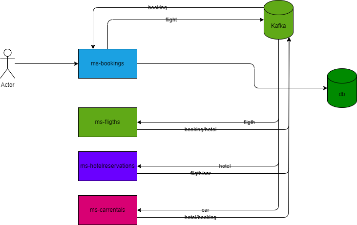

# ms-patron-saga-kafka-spring-boot
Ejemplo de empleo de Patron Saga, en microservicios con Spring Boot 3  java 21
Felix Antonio Sirit Murillo siritfelix@gmail.com 
# Introduccion
    Esta demo consiste en aplicar el patron saga, sobre una base de microservicios, que mantienen una comunicacion asincrona por medio del envio de mensajes usando Kafka, El caso de uso consiste en una reserva turistica(Booking) que consta de la reserva de un boleto de avion(fligthreservations), una reserva de hotel(hotelreservations) un alquiler de vehiculo (carrental). 
    La operacion de la reserva es trasnsaccional, lo que implica que cada una de las reservas debe terminar en estado OK o exitosa, en caso contrario, poder revertir los procesos anteriores de reserva, para ello, se maneja los estado de de cada operacion de reserva en PROCESING, ERROR, OK, CANCELLED:

1) PROCESING indica que esta en cola lista para ser procesada. 
2) ERROR operacion fallida y debe ser devuleta para revertir estado. 
3) OK operacion exitosa y lista para la siguiente operacion. 
4) CANCELLED indica que la operacion fue devuelta debido al un fallo de alguna operacion posterior.
# Flujo de operaciones



1) El ms-bookings recibe una petición de reserva, la cual guarda en base de datos su estado inicial, este es enviado a kafka con el tópico 'FlightReservation' para iniciar la reserva de boleto de avión.

2) El ms-fligthsreservations, esta a la escucha de mensajes con el tópico 'FlightReservation', analiza el estado y si la reserva de hotel contiene ERROR, indica que la reserva de boleto de avión debe ser devuelta y republicada en el tópico 'Booking', en caso contrario se procesa el mensaje y realiza la reserva de boleto de avión, para este caso de ejemplo solo se genera un proceso aleatorio para determinar el fin de la operación ya sea como OK o como ERROR. En caso de OK, este microservicio, publica un mensaje en kafka con el topico 'HotelReservation' para la reserva de hotel, y en caso contrario si la operación da ERROR, esta se publica con el tópico 'Booking' indicando que se debe devolver para su posterior actualización. NOTA, se agrego una lógica de reintentos para la reserva de boleto de avión, como opcional, republicando el mismo tópico para su posterior reprocesamiento, agregando una cantidad de intentos definida.

3) El ms-hotelreservations, escucha mensajes del tópico 'HotelReservation', analiza el estado de la reserva de vehículo y si contiene ERROR, indica que la reserva de hotel debe ser devuelta y republicada en el tópico 'FlightReservation', en caso contrario indica que esta operación ya posee una reserva de vuelo OK y se prepara para una reserva de hotel, de la misma forma la reserva de hotel para este ejemplo se genera en un proceso aleatorio para determinar el fin de la operación ya sea como OK o como ERROR. En caso de OK, este microservicio, publica un mensaje en kafka con el tópico 'CarRental' para la reserva de vehículo, y en caso contrario si la operación da ERROR, esta se publica con el tópico 'FlightReservation' indicando que se debe hacer devolucion de la reserva de vuelo.
4) El ultimo ms-carrental, escucha mensajes del tópico 'CarRental', en este punto indica que ya la reserva de vuelo la de hotel están con estado OK, por lo que se procede a realizar la reserva de vehículo, de la misma forma que los ms anteriores se genera en un proceso aleatorio para determinar el fin de la operación ya sea como OK o como ERROR. En caso de OK, este microservicio, publica un mensaje final en kafka con el tópico 'Booking' para terminar con el flujo, y en caso contrario si la operación da ERROR, esta se publica con el tópico 'HotelReservation' indicando que se debe hacer devolución de la reserva de vuelo. de esta misma forma al devolver al ms-hotelreservations, este luego devolverá a ms-fligthsreservations y luego ms-bookings para actualizar en base de datos el estado final de la transacción.


# Tecnologías necesarias

`Java-21` `Maven` `Spring-Boot` `h2` `kafka` `zipkin`
1) Kafka , se uso esta tecnología para manejar mensajes, el mismo se puede levantar con docker posicionándose en el directorio docker-files\kafka\docker-compose.yml
> docker-compose up -d
2) Zipkin, se agrego el manejo de trazabilidad con zipkin, para poder visualizar el punto de partida de una petición hasta su finalización, para ello se agregaron dependencias  se habilito las opciones de observabilidad  en kafka durante la configuración:
En docker-files\zipkin\docker-compose.yml
> docker-compose up -d
 ```java
@Bean
public ConcurrentKafkaListenerContainerFactory<String, BookingRequestDto>  kafkaListenerContainerFactory() {
    ConcurrentKafkaListenerContainerFactory<String, BookingRequestDto> factory = new ConcurrentKafkaListenerContainerFactory<>();
    factory.setConsumerFactory(consumerFactory());
    factory.getContainerProperties().setObservationEnabled(true);
    return factory;
}

@Bean
public KafkaTemplate<String, BookingRequestDto> kafkaTemplate() {
    KafkaTemplate<String, BookingRequestDto> kafkaTemplate = new KafkaTemplate<String, BookingRequestDto>(
            producerFactory());
    kafkaTemplate.setObservationEnabled(true);
    return kafkaTemplate;
}
```
>
# Pasos para levantar el proyecto
Para levantar cada proyecto, se agrego un archivo para setear variables de entorno .env, con los tipicos y puertos, se debe tomar en cuenta a la hora de levantar cada proecto, de igual forma se pueden crear estas variables empleando cualquier ide. 
# Consideraciones
Se agrego para serializar y deserializar el modulo JavaTimeModule de com.fasterxml.jackson.datatype.jsr310.JavaTimeModule, para manejar correctamente los tipos de datos LocalDateTime, por ello se configura un Mapper con este modulo
 ```java
@Configuration
public class JacksonConfig {
    @Bean
    public ObjectMapper objectMapper() {
        ObjectMapper mapper = new ObjectMapper();
        mapper.registerModule(new JavaTimeModule());
        mapper.setDateFormat(new SimpleDateFormat("yyyy-MM-dd'T'HH:mm:ss"));
        mapper.disable(SerializationFeature.WRITE_DATES_AS_TIMESTAMPS);
        return mapper;
    }
}
 ```
